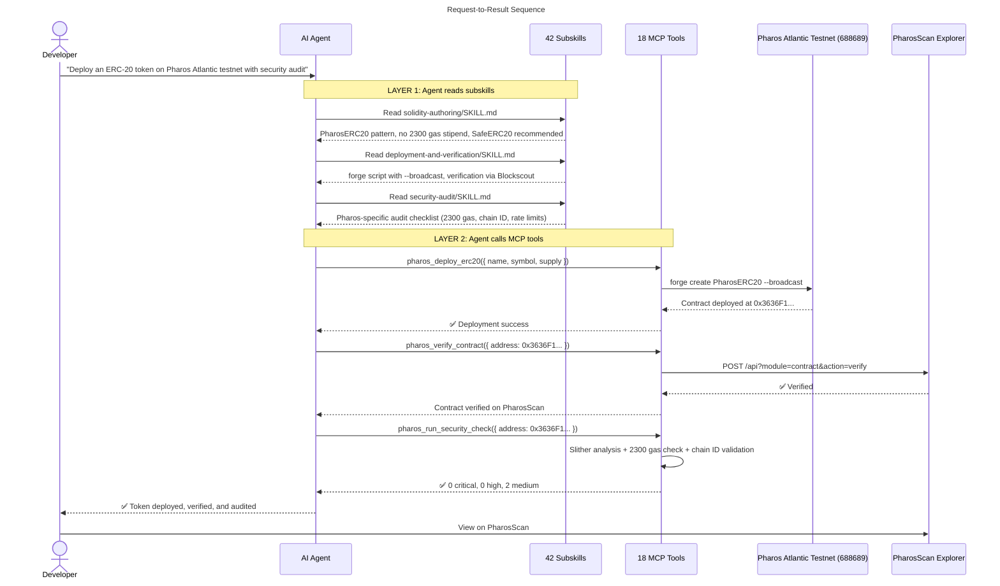
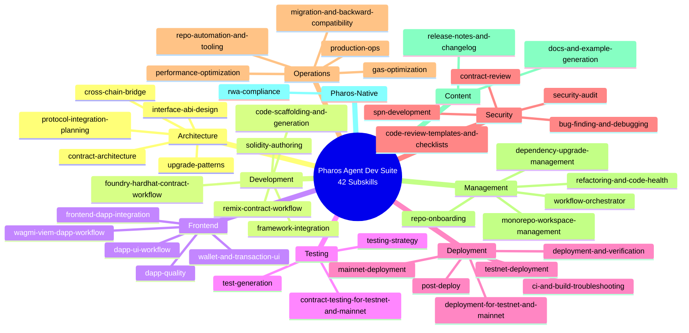
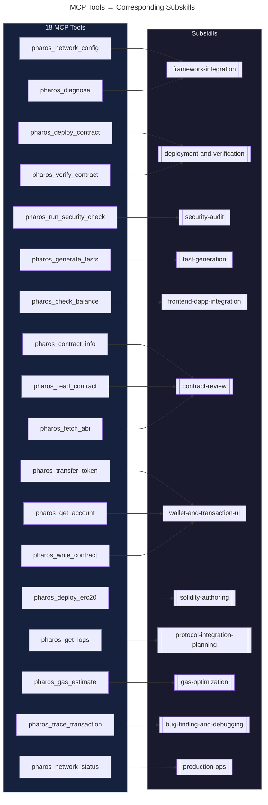
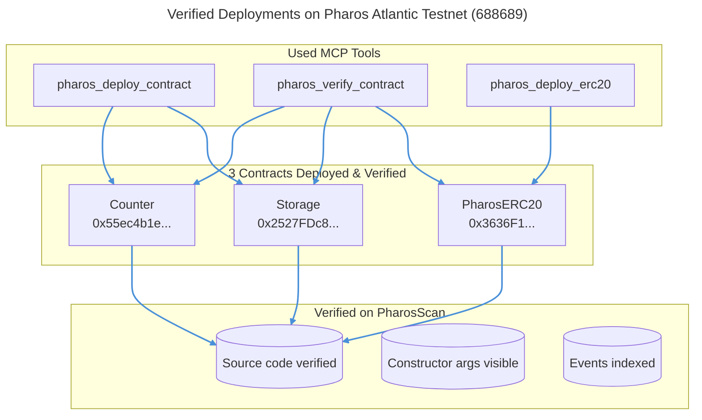

# Pharos Skill-to-Agent Dual Cascade

```mermaid
---
title: Pharos Agent Dev Suite — Architecture Overview
---
flowchart TB
    subgraph User[" "]
        REQ[("User Request")]
    end

    subgraph L1["Layer 1: 42 Instruction Subskills"]
        direction LR
        S1[[solidity-authoring]]
        S2[[deployment-and-verification]]
        S3[[security-audit]]
        S4[[rwa-compliance]]
        S5[[production-ops]]
        S6[[gas-optimization]]
        S7[[frontend-dapp-integration]]
        S8[[cross-chain-bridge]]
    end

    subgraph L2["Layer 2: 18 Executable MCP Tools"]
        T1[pharos_network_config]
        T2[pharos_deploy_contract]
        T3[pharos_verify_contract]
        T4[pharos_run_security_check]
        T5[pharos_generate_tests]
        T6[pharos_check_balance]
        T7[pharos_contract_info]
        T8[pharos_transfer_token]
        T9[pharos_deploy_erc20]
        T10[pharos_get_logs]
        T11[pharos_diagnose]
        T12[pharos_get_account]
        T13[pharos_gas_estimate]
        T14[pharos_trace_transaction]
        T15[pharos_network_status]
        T16[pharos_read_contract]
        T17[pharos_write_contract]
        T18[pharos_fetch_abi]
    end

    subgraph Pharos["Pharos Blockchain"]
        AT[("Atlantic Testnet\n688689")]
        PM[("Pacific Mainnet\n1672")]
    end

    REQ --> L1
    L1 -->|agent reads subskills| L2
    L2 -->|agent calls tools| Pharos
    L2 -->|verify on explorer| EXP[("PharosScan")]

    style REQ fill:#4a90d9,color:#fff,stroke:#fff
    style L1 fill:#1a1a2e,color:#e0e0e0,stroke:#4a90d9
    style L2 fill:#16213e,color:#e0e0e0,stroke:#4a90d9
    style AT fill:#0f3460,color:#e0e0e0,stroke:#e94560
    style PM fill:#0f3460,color:#e0e0e0,stroke:#e94560
    style EXP fill:#1a1a2e,color:#e0e0e0,stroke:#ffd700
```

---

## Cascade Flow

---

## Skill Taxonomy

---

## Tool-to-Subskill Mapping

---

## On-Chain Proof

---

## Quick Reference

| Layer | Count | What It Does |
|---|---|---|
| **Layer 1** | 42 subskills | Teaches AI agents Pharos-specific patterns, conventions, and best practices |
| **Layer 2** | 18 MCP tools | Executes real on-chain operations on Pharos Atlantic & Pacific networks |
| **Cascade** | User → Subskills → Tools → Blockchain | Agent reads (learns) then calls (executes) — the dual-layer cascade |
