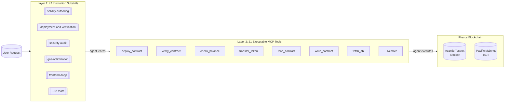

# Pharos Agent Dev Suite

[](https://github.com/tejas0111/Pharos/actions)
[](https://atlantic.pharosscan.xyz)
[](https://pharos-ads.netlify.app/docs.html)
[](#skill-map)
[](LICENSE)
[](https://docs.pharos.xyz)

**A dual-layer Pharos Skill — 42 instruction subskills for human developers + 21 executable MCP tools for autonomous AI agents.**

Built for the Pharos Skill-to-Agent Hackathon (Atlantic Testnet 688689 / Pacific Mainnet 1672).

> ### The Cascade
> An AI agent reads Pharos subskills in **Layer 1**, learns what to do, then calls **Layer 2** MCP tools to execute on-chain. See the full walkthrough in [`CASCADE.md`](./CASCADE.md).
>
> **🌐 Website & Demo**: [pharos-ads.netlify.app](https://pharos-ads.netlify.app) — landing page, docs, and demo video.



### Layer 1: 42 Prompt-Only Subskills

For human developers using AI coding assistants (Codex, Claude Code, OpenCode, Gemini CLI):
- **42 focused subskills** — architecture, Solidity, deployment, frontend, security, and more
- **Plan-first execution** — agents draft a plan before touching code
- **Approval gates** — higher-risk work requires explicit confirmation
- **Structured output** — downstream agents can reuse results

### Layer 2: 21 Executable MCP Tools

For autonomous AI agents that execute real on-chain operations:
- **Deploy**, **verify**, and **transfer** on Pharos networks
- **Check balances**, **fetch logs**, and **trace transactions** with `debug_traceTransaction`
- **Get account state** via Pharos-specific `eth_getAccount` RPC
- **Monitor network status** with safe/finalized block tags
- **Estimate gas** with EIP-1559 breakdown
- **Run security checks** and **generate tests**
- **Diagnose your environment** before on-chain actions

### Live On-Chain Proof

3 contracts deployed on Pharos Atlantic Testnet (688689):

| Contract | Address | Explorer |
|----------|---------|----------|
| **Counter** | `0x55ec4b1e32537b6f72aa20153735709837488e4e` | <a href="https://atlantic.pharosscan.xyz/address/0x55ec4b1e32537b6f72aa20153735709837488e4e" target="_blank" rel="noopener noreferrer">View</a> | ✅ |
| **Storage** | `0x2527FDc8C6FdF7C5239f005D94Cc7dC6173d34f0` | <a href="https://atlantic.pharosscan.xyz/address/0x2527FDc8C6FdF7C5239f005D94Cc7dC6173d34f0" target="_blank" rel="noopener noreferrer">View</a> | ✅ |
| **PharosERC20** | `0x3636F1BBcc56D1b5a22F8B778494D1553d95B4CD` | <a href="https://atlantic.pharosscan.xyz/address/0x3636F1BBcc56D1b5a22F8B778494D1553d95B4CD" target="_blank" rel="noopener noreferrer">View</a> | ✅ |

### Uniquely Pharos

Two capabilities in this skill exist for **NO other blockchain**:

| Feature | Subskill | Why It Matters |
|---------|----------|----------------|
| **SPN (Subnet Processing Network)** | `spn-development` | Pharos-native L2 subnets for dedicated compute — no other L1 offers this |
| **RWA Compliance** | `rwa-compliance` | Real-world asset tokenization with regulatory checks — Pharos's core focus |

### Why This Entry

| Dimension | This Entry | Typical Entry |
|---|---|---|
| Format | **Dual-layer**: subskills + MCP tools | Single format only |
| On-chain proof | **3 verified contracts** on Atlantic testnet | No deployment or code only |
| Tool count | **42 subskills + 21 MCP tools** | Under 10 skills |
| Pharos-specific | SPN, safe/finalized tags, eth_getAccount, no-2300-gas patterns | Generic EVM advice |
| Live demo | `node agent/mcp-demo.mjs` calls 6 tools through the real MCP server | No demo or single command |
| Phase 2 ready | Anvita Flow integration (x402 micropayments) documented | No forward planning |

### Anvita Flow Ready

This skill is pre-configured for deployment on **Anvita Flow** (Ant Group's AI Agent platform with x402 micropayments). See [ANVITA_FLOW_INTEGRATION.md](./ANVITA_FLOW_INTEGRATION.md) for Phase 2 readiness.

## Install

```bash
npx skills add https://github.com/tejas0111/Pharos
```

<details>
<summary><b>Installation Details (expand for your AI tool)</b></summary>

| Tool | Command |
|------|---------|
| OpenClaw | `npx clawhub install https://github.com/tejas0111/Pharos` |
| Codex | `mkdir -p ~/.codex/skills/pharos-agent-dev-suite && cp -R skill/* ~/.codex/skills/pharos-agent-dev-suite/` |
| Claude Code | `mkdir -p ~/.claude/skills/pharos-agent-dev-suite && cp -R skill/* ~/.claude/skills/pharos-agent-dev-suite/` |
| OpenCode | Add `{"skills": ["skill/"]}` to `opencode.json` |
| Gemini CLI | `mkdir -p ~/.gemini/skills/pharos-agent-dev-suite && cp -R skill/* ~/.gemini/skills/pharos-agent-dev-suite/` |
</details>

## Try It Now

```bash
# 1. Run the MCP server (check environment, no PRIVATE_KEY needed)
cd mcp-server && npm install && node index.js

# 2. Run the MCP demo (6 read-only tools through real server — no key needed)
node agent/mcp-demo.mjs

# 3. Full token workflow (simulation mode — set PRIVATE_KEY for real on-chain)
node agent/token-workflow.mjs

# 4. Or deploy Counter to testnet with forge
forge script script/Deploy.s.sol:DeployCounter --rpc-url https://atlantic.dplabs-internal.com --broadcast
```

📺 **Watch the demo video** at **[pharos-ads.netlify.app](https://pharos-ads.netlify.app)** — or browse the [docs](https://pharos-ads.netlify.app/docs.html).

## Usage

Reference a subskill in your prompt:

```
@pharos-agent-dev-suite deploy this contract to Atlantic testnet
```

The agent classifies your request, routes to the appropriate subskill, presents a plan, and executes with verification.

## MCP Server

The Pharos MCP Server exposes **21 executable tools** for AI agents to interact with the Pharos blockchain. It runs as a stdio-based MCP server compatible with Claude Desktop and other MCP hosts.

| # | Tool | Description | Executes? |
|---|------|-------------|-----------|
| 1 | `pharos_network_config` | Get network configuration (RPC, chain ID, explorer) | Static |
| 2 | `pharos_deploy_contract` | Deploy a compiled contract via `forge script` | Yes |
| 3 | `pharos_verify_contract` | Verify contract on PharosScan via explorer API | Yes |
| 4 | `pharos_run_security_check` | Run `slither` + structured security review | Yes |
| 5 | `pharos_generate_tests` | Write Foundry test file to disk | Yes |
| 6 | `pharos_check_balance` | Check PHRS/PROS balance via RPC | Yes |
| 7 | `pharos_contract_info` | Fetch contract metadata from explorer API | Yes |
| 8 | `pharos_transfer_token` | Send PHRS/PROS using walletClient | Yes |
| 9 | `pharos_deploy_erc20` | Deploy ERC-20 token via `forge create` | Yes |
| 10 | `pharos_get_logs` | Fetch event logs with block range | Yes |
| 11 | `pharos_diagnose` | Check environment: deps, RPC, env vars | Yes |
| 12 | `pharos_get_account` | Get account state via Pharos-specific `eth_getAccount` RPC | Yes |
| 13 | `pharos_gas_estimate` | Estimate gas prices with EIP-1559 breakdown | Yes |
| 14 | `pharos_trace_transaction` | Trace a tx with `debug_traceTransaction` (Pharos enables this) | Yes |
| 15 | `pharos_network_status` | Check safe/finalized block numbers and gas prices | Yes |
| 16 | `pharos_read_contract` | Call any view/pure function on a deployed contract via its ABI | Yes |
| 17 | `pharos_write_contract` | Call any state-changing function via ABI (simulate then broadcast) | Yes |
| 18 | `pharos_fetch_abi` | Download verified ABI JSON from PharosScan explorer | Yes |
| 19 | `pharos_frontend_sync` | Sync deployed contract address and ABI to a frontend project | Yes |
| 20 | `pharos_create_safe_tx` | Build a Safe transaction payload for multi-sig execution | Yes |
| 21 | `pharos_propose_safe_tx` | Prepare a Safe multi-sig transaction for proposal via Safe Transaction Service | Yes |

### Quick Start

```bash
cd mcp-server
npm install
export PRIVATE_KEY=0x...
export PHAROS_TESTNET_RPC_URL=https://atlantic.dplabs-internal.com
node index.js
```

### Security Warning

**Never hardcode your PRIVATE_KEY in any config file.** Always use environment variables or a secrets manager. The MCP server reads `PRIVATE_KEY` from the environment only and NEVER exposes it in tool output.

### Claude Desktop Integration

Add to `claude_desktop_config.json`:

```json
{
  "mcpServers": {
    "pharos": {
      "command": "node",
      "args": ["/path/to/mcp-server/index.js"],
      "env": {
        "PRIVATE_KEY": "${PRIVATE_KEY}",
        "PHAROS_TESTNET_RPC_URL": "https://atlantic.dplabs-internal.com",
        "PHAROS_MAINNET_RPC_URL": "https://rpc.pharos.xyz"
      }
    }
  }
}
```

See [mcp-server/README.md](./mcp-server/README.md) for full documentation.

## Skill Map

| Subskill | Best For | Gate |
|---|---|---|
| `contract-architecture` | module boundaries, storage, permissions, upgrade stance | required |
| `solidity-authoring` | writing or refactoring Solidity | required |
| `interface-abi-design` | interfaces, events, errors, typed bindings | required |
| `protocol-integration-planning` | read/write call sequences and approval flow | required |
| `frontend-dapp-integration` | UI wiring to contract state and actions | required |
| `wallet-and-transaction-ui` | transaction preview, status, and history flows | required |
| `framework-integration` | Next.js, wagmi, viem, ethers, Foundry, Hardhat, Remix | optional |
| `testing-strategy` | test scope, fixtures, and coverage plan | required |
| `test-generation` | writing concrete tests and fixtures | required |
| `contract-review` | security, correctness, gas, and design review | required |
| `bug-finding-and-debugging` | root-cause analysis and narrow fixes | required |
| `deployment-and-verification` | deploy prep, verification, and release checks | required |
| `repo-onboarding` | mapping the codebase and entrypoints | optional |
| `docs-and-example-generation` | docs, examples, and usage notes | optional |
| `ci-and-build-troubleshooting` | failing builds, lint, type errors, CI regressions | required |
| `migration-and-backward-compatibility` | safe upgrades, rewrites, rollback planning | required |
| `refactoring-and-code-health` | behavior-preserving cleanup and structure improvements | required |
| `dependency-upgrade-management` | package, toolchain, and version upgrades | required |
| `performance-optimization` | runtime, render, bundle, and hot-path improvements | required |
| `release-notes-and-changelog` | release notes, changelog entries, PR summaries | optional |
| `code-scaffolding-and-generation` | boilerplate, templates, and starter files | optional |
| `monorepo-workspace-management` | workspace boundaries and shared tooling | required |
| `repo-automation-and-tooling` | scripts, automation, and local tooling | optional |
| `deployment-for-testnet-and-mainnet` | network-aware deployment planning | required |
| `contract-testing-for-testnet-and-mainnet` | network-specific contract tests and checks | required |
| `code-review-templates-and-checklists` | PR checklists and review rubrics | optional |
| `wagmi-viem-dapp-workflow` | wallet connect and contract flow helpers | optional |
| `foundry-hardhat-contract-workflow` | Solidity dev workflows in Foundry or Hardhat | optional |
| `remix-contract-workflow` | Remix/browser Solidity workflows | optional |
| `cross-chain-bridge` | cross-chain bridge design and integration | required |
| `dapp-quality` | a11y, i18n, Zustand state management for Pharos dapps | required |
| `dapp-ui-workflow` | React, Next.js, Tailwind, shadcn components for Pharos dapps | required |
| `upgrade-patterns` | proxy, beacon, and diamond upgrade strategies | required |
| `gas-optimization` | gas profiling and optimization techniques | optional |
| `security-audit` | comprehensive security review and audit | required |
| `production-ops` | production monitoring, incident response, ops | required |
| `spn-development` | Subnet (SPN) development and management | required |
| `rwa-compliance` | real-world asset compliance and regulatory | required |
| `workflow-orchestrator` | multi-step workflow orchestration | required |
| `post-deploy` | post-deployment monitoring and maintenance | required |
| `mainnet-deployment` | production deployment on Pacific Mainnet (1672, PROS) | required |
| `testnet-deployment` | testnet deployment on Atlantic Testnet (688689, PHRS) | required |

## Workflow

1. Agent classifies the request into the appropriate subskill
2. Gathers minimal relevant context (stack, repo structure, affected files)
3. Drafts a concrete plan before making changes
4. Presents the plan for review
5. High-risk tasks wait for explicit approval
6. Makes the smallest useful change
7. Verifies with the narrowest meaningful check
8. Returns a concise summary with a structured handoff

## Repository Layout

```
skill/
  SKILL.md              # master skill -- routing and orchestration
  subskills/*/SKILL.md  # 42 focused subskills
  references/*.md       # network context, deployment patterns, harness
  scripts/*.sh          # deploy and verify scripts (Foundry)
contracts/              # example Solidity contracts (3 deployed on testnet)
test/                   # Foundry tests (34) + MCP server tests (21) = 55 total
script/                 # Forge deploy scripts
config/                 # Pharos network configuration
shared/                 # viem defineChain configs
mcp-server/             # MCP server with 21 executable tools for AI agents
.github/workflows/      # CI/CD deploy pipeline
foundry.toml            # Foundry config with Pharos RPC endpoints
.env.example            # environment variable template
LICENSE                 # MIT licensed
DEPLOYMENTS.md          # live on-chain deployment proof
ANVITA_FLOW_INTEGRATION.md  # Phase 2 readiness documentation
```

## On-Chain Deployment

3 contracts deployed and confirmed on Pharos Atlantic Testnet (688689):

| Contract | Address | Tx Hash | Explorer |
|----------|---------|---------|----------|
| **Counter** | `0x55ec4b1e32537b6f72aa20153735709837488e4e` | `0x0f1891dee4bd6fa7901ef287e0bef044f10bff1d445a5645ea15da723085e411` | <a href="https://atlantic.pharosscan.xyz/address/0x55ec4b1e32537b6f72aa20153735709837488e4e" target="_blank" rel="noopener noreferrer">View</a> | ✅ |
| **Storage** | `0x2527FDc8C6FdF7C5239f005D94Cc7dC6173d34f0` | `0xed4bd34a99282782e9e6b9670ac8703148560c34fc695896aeb6b36458b94001` | <a href="https://atlantic.pharosscan.xyz/address/0x2527FDc8C6FdF7C5239f005D94Cc7dC6173d34f0" target="_blank" rel="noopener noreferrer">View</a> | ✅ |
| **PharosERC20** | `0x3636F1BBcc56D1b5a22F8B778494D1553d95B4CD` | `0xcdf144d1f2ca398ece1a8b718c690347d673e5121479318fcc0d23d3523844ec` | <a href="https://atlantic.pharosscan.xyz/address/0x3636F1BBcc56D1b5a22F8B778494D1553d95B4CD" target="_blank" rel="noopener noreferrer">View</a> | ✅ |

See [DEPLOYMENTS.md](./DEPLOYMENTS.md) for full details.

To deploy your own:

```bash
cp .env.example .env   # add PRIVATE_KEY
forge build
forge test
SIMULATE_ONLY=1 bash skill/scripts/deploy-testnet.sh   # simulate first
bash skill/scripts/deploy-testnet.sh                    # broadcast
```

Get testnet PHRS from the <a href="https://testnet.pharosnetwork.xyz" target="_blank" rel="noopener noreferrer">Pharos Faucet</a>.

## Pharos Networks

| Network | Chain ID | Explorer | Faucet |
|---|---|---|---|
| Atlantic Testnet | 688689 | <a href="https://atlantic.pharosscan.xyz" target="_blank" rel="noopener noreferrer">atlantic.pharosscan.xyz</a> | <a href="https://testnet.pharosnetwork.xyz" target="_blank" rel="noopener noreferrer">faucet</a> |
| Pacific Mainnet | 1672 | <a href="https://pharosscan.xyz" target="_blank" rel="noopener noreferrer">pharosscan.xyz</a> | -- |
