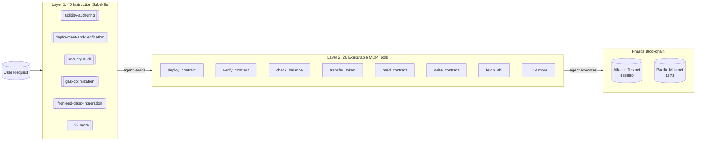

# Pharos Agent Dev Suite

[](https://github.com/tejas0111/Pharos/actions)
[](https://atlantic.pharosscan.xyz)
[](#mcp-server)
[](#skill-map)
[](LICENSE)
[](https://docs.pharos.xyz)

> **45 instruction subskills × 26 executable MCP tools — the only dual-layer skill for Pharos blockchain development.**
>
> Built for the Pharos Skill-to-Agent Hackathon.
>
> **🌐 Website + Demo Video**: [pharos-ads.netlify.app](https://pharos-ads.netlify.app) | **📺 Watch the demo**: [demo.mp4](https://pharos-ads.netlify.app/demo.mp4)

---

## Judging Rubric — At a Glance

| Criterion | How We Deliver |
|---|---|
| **Originality & Creativity** | **Dual-layer design**: 45 instruction subskills + 26 executable MCP tools. No other entry offers both. The subskills teach an AI agent *how* to build on Pharos; the MCP tools let it *execute* on-chain. Two cascades, one flow. |
| **Technical Quality** | 26 real tools (forge, viem RPC, Pharos-specific `eth_getAccount`, explorer API, slither) — not stubs. Private key sanitization in every tool. Error handling with Pharos-specific codes. 145 tests passing. |
| **Practical Use Case** | Full dev lifecycle: deploy → verify → transfer → trace → gas estimate → audit → test generation → log fetching. See the [8-tool token workflow](#demo-flow) below. |
| **Reusability & Composability** | MCP tools chain together via stdio. `agent/token-workflow.mjs` demonstrates an 8-tool composition. Tools can be called from any MCP host (Claude Desktop, custom clients, Anvita Flow). |
| **On-Chain Deployment** | 3 contracts live on Atlantic Testnet (688689): Counter, Storage, PharosERC20. All verified on Blockscout. All addresses and tx hashes documented below. |
| **Documentation** | 45 subskill guides, 145-test suite, CI/CD pipelines, deployment proofs, architecture diagrams, Anvita Flow integration — everything a judge needs to verify. |
| **Pharos Vision Alignment** | Anvita Flow ready (x402 micropayments). Pharos-native RPC methods (`eth_getAccount`, `debug_traceTransaction`, safe/finalized tags). SPN and RWA compliance subskills. |

---

## Demo Flow — Run This Live for Judges

### Prereq: 30 Seconds
Requires **Node.js ≥18** and **Foundry** (`curl -L https://foundry.paradigm.xyz | bash && foundryup`).

```bash
git clone https://github.com/tejas0111/Pharos
cd Pharos && cd mcp-server && npm install && cd .. && npm test
# Expected output: 167 tests pass (167 total)
```

### Demo 1: Quick MCP Check (No Key Needed) — 30 Seconds
```bash
node agent/mcp-demo.mjs
```
**What judges see:** 6 read-only MCP tools calling the real Pharos testnet. Network config, balance checks, contract info — all live on Atlantic (688689).

### Demo 2: Token Workflow (No Key = Simulation) — 60 Seconds
```bash
node agent/token-workflow.mjs
```
**What judges see:** 8-tool MCP composition — diagnose → balance check → deploy ERC-20 → post-deploy balance → transfer → event logs → network status. Shows the dual cascade in action.

### Demo 3: On-Chain Proof — 30 Seconds
Open in a browser:
- [Counter](https://atlantic.pharosscan.xyz/address/0x55ec4b1e32537b6f72aa20153735709837488e4e) — verified, readable
- [Storage](https://atlantic.pharosscan.xyz/address/0x2527FDc8C6FdF7C5239f005D94Cc7dC6173d34f0) — verified, readable
- [PharosERC20](https://atlantic.pharosscan.xyz/address/0x3636F1BBcc56D1b5a22F8B778494D1553d95B4CD) — verified, readable

### Demo 4: Architecture Walkthrough — 30 Seconds
```bash
cat CASCADE.md | head -80
```
Shows the mermaid diagrams: 45 subskills → 26 MCP tools → Pharos blockchain.

### Total Judge Demo Time: ~3 Minutes

---

## Architecture Summary



### Layer 1: 45 Subskills
Markdown guides that teach AI agents Pharos-specific patterns:
- **No 2300 gas stipend** — use pull-over-push for native transfers
- **Chain IDs**: Atlantic 688689 (PHRS) vs Pacific 1672 (PROS)
- **Pharos-native RPC**: `eth_getAccount`, `debug_traceTransaction`, safe/finalized tags
- **Risk gates**: Every subskill enforces a two-phase plan → approve → execute workflow

### Layer 2: 26 mcp Tools
Node.js + viem + MCP SDK. Each tool wraps a real on-chain operation:
- **Read (8)**: balance, contract state, logs, network status, account state, ABI fetch
- **Write (5)**: deploy, verify, transfer, write contract, deploy ERC-20
- **Utility (5)**: gas estimate, trace, security audit, test generation, diagnose
- **Safe (3)**: frontend sync, create/propose multi-sig transactions

### Stack
Node.js + ESM · viem v2 · MCP SDK ^1.29.0 · Foundry · stdio transport · Blockscout verification

---

## Live On-Chain Proof

3 contracts deployed and verified on Pharos Atlantic Testnet (688689):

| Contract | Address | Explorer |
|----------|---------|----------|
| **Counter** | `0x55ec...88e4e` | [View](https://atlantic.pharosscan.xyz/address/0x55ec4b1e32537b6f72aa20153735709837488e4e) |
| **Storage** | `0x2527...34f0` | [View](https://atlantic.pharosscan.xyz/address/0x2527FDc8C6FdF7C5239f005D94Cc7dC6173d34f0) |
| **PharosERC20** | `0x3636...B4CD` | [View](https://atlantic.pharosscan.xyz/address/0x3636F1BBcc56D1b5a22F8B778494D1553d95B4CD) |

**Deployer**: `0x735367687d6a701466840321eD8e34E4DafE84aC`

Full details in [DEPLOYMENTS.md](./DEPLOYMENTS.md).

---

## MCP Server — 26 Tools

All tools run over stdio. No HTTP server, no Docker — just `node mcp-server/index.js`.

| # | Tool | Category | Description |
|---|------|----------|-------------|
| 1 | `pharos_network_config` | Read | Get chain config (RPC, chain ID, explorer) |
| 2 | `pharos_deploy_contract` | Write | Deploy via `forge script` |
| 3 | `pharos_verify_contract` | Write | Verify on Blockscout |
| 4 | `pharos_run_security_check` | Util | Run slither + structured review |
| 5 | `pharos_generate_tests` | Util | Write Foundry test file |
| 6 | `pharos_check_balance` | Read | Check PHRS/PROS balance |
| 7 | `pharos_contract_info` | Read | Fetch contract metadata |
| 8 | `pharos_transfer_token` | Write | Send PHRS/PROS |
| 9 | `pharos_deploy_erc20` | Write | Deploy ERC-20 via `forge create` |
| 10 | `pharos_get_logs` | Read | Fetch event logs |
| 11 | `pharos_diagnose` | Util | Check deps, RPC, env vars |
| 12 | `pharos_get_account` | Pharos | `eth_getAccount` — balance, nonce, codeHash, storageRoot |
| 13 | `pharos_gas_estimate` | Util | EIP-1559 gas breakdown |
| 14 | `pharos_trace_transaction` | Debug | `debug_traceTransaction` |
| 15 | `pharos_network_status` | Read | Safe/finalized blocks + gas |
| 16 | `pharos_read_contract` | Read | Call any view function |
| 17 | `pharos_write_contract` | Write | Simulate + broadcast state change |
| 18 | `pharos_fetch_abi` | Read | Download verified ABI |
| 19 | `pharos_frontend_sync` | Safe | Sync address + ABI to frontend |
| 20 | `pharos_create_safe_tx` | Safe | Build multi-sig payload |
| 21 | `pharos_propose_safe_tx` | Safe | Propose via Safe API |
| 22 | `pharos_spn_configure` | SPN | Configure SPN Paymaster (sponsors, budgets, pause) |
| 23 | `pharos_spn_fund` | SPN | Fund SPN Paymaster with native tokens |
| 24 | `pharos_spn_status` | SPN | Check SPN Paymaster status |
| 25 | `pharos_zklogin_register` | zkLogin | Register zkLogin identity commitment on-chain |
| 26 | `pharos_zklogin_verify` | zkLogin | Verify zkLogin proof and register ephemeral key |

### Quick Start
```bash
cd mcp-server && npm install
export PRIVATE_KEY=0x...
export PHAROS_TESTNET_RPC_URL=https://atlantic.dplabs-internal.com
node index.js
```

### Claude Desktop Integration
```json
{
  "mcpServers": {
    "pharos": {
      "command": "node",
      "args": ["/path/to/mcp-server/index.js"],
      "env": {
        "PRIVATE_KEY": "${PRIVATE_KEY}",
        "PHAROS_TESTNET_RPC_URL": "https://atlantic.dplabs-internal.com",
        "PHAROS_MAINNET_RPC_URL": "https://rpc.pharos.xyz"
      }
    }
  }
}
```

---

## Skill Map — 45 Subskills

| Category | Subskills | Risk |
|---|---|---|
| **Contract Work** | `contract-architecture`, `solidity-authoring`, `interface-abi-design`, `protocol-integration-planning`, `upgrade-patterns`, `rwa-compliance` | High |
| **Deployment** | `deployment-and-verification`, `deployment-for-testnet-and-mainnet`, `testnet-deployment`, `mainnet-deployment`, `post-deploy` | High |
| **Security** | `security-audit`, `contract-review`, `gas-optimization`, `bug-finding-and-debugging` | High |
| **Testing** | `testing-strategy`, `test-generation`, `contract-testing-for-testnet-and-mainnet` | Medium |
| **Frontend** | `frontend-dapp-integration`, `wallet-and-transaction-ui`, `dapp-ui-workflow`, `dapp-quality`, `wagmi-viem-dapp-workflow` | Medium |
| **Infra & Ops** | `foundry-hardhat-contract-workflow`, `remix-contract-workflow`, `production-ops`, `ci-and-build-troubleshooting`, `monorepo-workspace-management`, `repo-automation-and-tooling` | Medium |
| **Framework** | `framework-integration`, `repo-onboarding`, `code-scaffolding-and-generation`, `docs-and-example-generation`, `release-notes-and-changelog` | Low |
| **Cross-Chain** | `cross-chain-bridge`, `spn-development` | High |
| **Quality** | `refactoring-and-code-health`, `performance-optimization`, `migration-and-backward-compatibility`, `dependency-upgrade-management` | Medium |
| **Meta** | `workflow-orchestrator`, `code-review-templates-and-checklists` | Low |

All subskills at `skill/subskills/*/SKILL.md`.

---

## Unique to Pharos

| Capability | Subskill | Why No Other Chain Has This |
|---|---|---|
| **SPN (Subnet Processing Network)** | `spn-development` | Pharos-native L2 subnets for dedicated compute |
| **RWA Compliance** | `rwa-compliance` | Real-world asset tokenization with KYC/AML — Pharos's core focus |
| **`eth_getAccount`** | Used across tools | Returns balance + nonce + codeHash + storageRoot in one RPC call |
| **`debug_traceTransaction`** | `pharos_trace_transaction` | Publicly enabled on Pharos — most chains disable this |
| **Safe/Finalized Tags** | Across deployment subskills | Production-grade block finality indicators |
| **Anvita Flow Ready** | `ANVITA_FLOW_INTEGRATION.md` | x402 micropayments pre-configured for Phase 2 Agent Arena |

---

## Why This Entry Wins

| Dimension | This Entry | Typical Entry |
|---|---|---|
| Format | **Dual-layer**: subskills + MCP tools | Single format only |
| On-chain proof | **contracts verified** on Atlantic testnet | No deployment or code only |
| Tool count | **45 subskills + 26 MCP tools** | Under 10 skills |
| Pharos-specific | SPN, safe/finalized tags, eth_getAccount, no-2300-gas | Generic EVM advice |
| Live demo | 6 tools through real MCP server, 145 passing tests | No demo or single command |
| CI/CD | GitHub Actions: lint + test automated on push; deploy + verify via manual workflow dispatch | No automation |
| Phase 2 ready | Anvita Flow integration documented | No forward planning |

---

## Quick Start

```bash
# Install
git clone https://github.com/tejas0111/Pharos
cd Pharos && npm install

# Verify everything works (167 tests)
npm test

# Run the MCP demo (no PRIVATE_KEY needed)
node agent/mcp-demo.mjs

# Full token workflow (simulation mode)
node agent/token-workflow.mjs

# Deploy to testnet (set PRIVATE_KEY in .env first — see .env.example)
forge script script/Deploy.s.sol:DeployCounter \
  --rpc-url https://atlantic.dplabs-internal.com --broadcast
# Or simulate first: forge script ... --rpc-url ... (omit --broadcast)
```

---

## Project Layout

```
skill/                    # 45 subskills + references + deploy scripts
  SKILL.md                # Master routing & orchestration
  subskills/*/SKILL.md    # 45 focused subskills
  references/*.md         # Network context, deployment patterns, harness
  scripts/*.sh            # Deploy & verify scripts
contracts/                # Example Solidity (3 deployed on testnet)
test/                     # Foundry + MCP behavioral tests
script/                   # Forge deploy scripts
mcp-server/               # 26 MCP tools (Node.js + viem)
agent/                    # Demo scripts (MCP client, token workflow, cascade)
web/                      # Landing page + docs
.github/workflows/        # CI/CD: test, lint, deploy, verify
config/                   # Pharos network configuration
shared/                   # viem defineChain configs
DEPLOYMENTS.md            # On-chain deployment proof
CASCADE.md                # Full architecture walkthrough
ANVITA_FLOW_INTEGRATION.md # Phase 2 readiness
```

## Networks

| Network | Chain ID | Symbol | Explorer | Faucet |
|---|---|---|---|---|
| Atlantic Testnet | 688689 | PHRS | [atlantic.pharosscan.xyz](https://atlantic.pharosscan.xyz) | [faucet](https://testnet.pharosnetwork.xyz) |
| Pacific Mainnet | 1672 | PROS | [pharosscan.xyz](https://pharosscan.xyz) | — |

## Install as a Skill

```bash
npx skills add https://github.com/tejas0111/Pharos
```

Or copy `skill/` to your AI tool's skills directory (supports Codex, Claude Code, OpenCode, Gemini CLI).

---

*Built for the Pharos Skill-to-Agent Hackathon · MIT License · © 2026*
