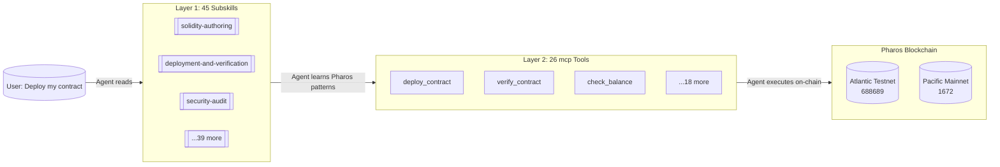

# Pharos Agent Dev Suite

> **45 instruction subskills × 26 executable MCP tools — the only dual-layer skill for Pharos blockchain development.**
>
> Built for the Pharos Skill-to-Agent Hackathon. Live on-chain proof on Atlantic Testnet (688689).

<p align="center">
  <a href="https://pharos-ads.netlify.app"><strong>🌐 Website & Demo Video →</strong></a> ·
  <a href="https://github.com/tejas0111/Pharos"><strong>🐙 GitHub Repository →</strong></a>
</p>

---

## 📋 One-Liner

**42 agent instruction subskills + 26 executable MCP tools + 3 live verified contracts on Pharos Atlantic Testnet — turning any AI coding agent into a Pharos blockchain specialist.**

---

## 🧠 What It Is

The **Pharos Agent Dev Suite** is a comprehensive skill package that turns any AI coding assistant (Codex, Claude Code, OpenCode, Gemini CLI) into a Pharos blockchain expert. It operates as a **dual-layer cascade**:

| Layer | What | Count | How It Works |
|-------|------|-------|-------------|
| **Layer 1** | Instruction subskills | 45 | Markdown guides that teach agents Pharos-specific patterns |
| **Layer 2** | Executable MCP tools | 26 | Real on-chain operations via viem + MCP SDK |

An agent reads a subskill to learn *how* to build on Pharos, then calls an MCP tool to *execute* on-chain. Two cascades, one flow — see the [architecture](#-architecture) section.

---

## 🏗️ Architecture

### Layer 1 — 45 Instruction Subskills

Each subskill is a markdown file at `skill/subskills/*/SKILL.md` that teaches an AI agent a specific Pharos domain. They cover the full dev lifecycle:

```
CONTRACT WORK (6)          DEPLOYMENT (5)           SECURITY (4)
├── contract-architecture  ├── deployment-prep      ├── security-audit
├── solidity-authoring     ├── testnet-deployment   ├── contract-review
├── interface-abi-design   ├── mainnet-deployment   ├── gas-optimization
├── protocol-integration   ├── post-deploy          └── bug-debugging
├── upgrade-patterns       └── verification
└── rwa-compliance

FRONTEND (5)               INFRA & OPS (6)          TESTING (3)
├── dapp-integration       ├── foundry-workflow     ├── testing-strategy
├── wallet-tx-ui           ├── hardhat-workflow     ├── test-generation
├── dapp-ui-workflow       ├── remix-workflow       └── network-testing
├── dapp-quality           ├── production-ops
└── wagmi-viem-workflow    ├── ci-troubleshooting
                           └── monorepo-management

CROSS-CHAIN (2)            QUALITY (4)              META (2)
├── cross-chain-bridge     ├── refactoring          ├── workflow-orchestrator
└── spn-development        ├── performance-opt      └── code-review-templates
                            ├── migration
                            └── dependency-upgrades
```

Each subskill teaches agents **Pharos-specific conventions** that generic agents miss:

| Pharos Convention | What Generic Agents Get Wrong | What Our Subskills Teach |
|---|---|---|
| **No 2300 gas stipend** | Sends `transfer()` with 2300 gas — tx reverts | Use pull-over-push pattern |
| **Chain IDs** | Uses wrong chain (688688 v1, now deprecated) | Atlantic = 688689, Pacific = 1672 |
| **Native token** | Calls both PHRS | Testnet = PHRS, Mainnet = PROS (18 decimals) |
| **`eth_getAccount`** | Makes 4+ RPC calls for account state | One call: balance + nonce + codeHash + storageRoot |
| **`debug_traceTransaction`** | Assumes it's disabled (like most chains) | It's publicly enabled on Pharos |
| **Safe/finalized tags** | Uses only `latest` | Use `safe`/`finalized` for production reads |
| **EIP-1559 gas** | Uses legacy gas pricing | Base fee + priority fee breakdown |
| **No API key on testnet** | Wastes time getting an API key | Blockscout verify — no key needed |
| **Block time ~2s** | Uses 12s Ethereum poll intervals | Faster tx confirmation polling |

### Layer 2 — 26 Executable MCP Tools

The MCP server at `mcp-server/index.js` exposes **26 real executable tools** over stdio transport. Every tool wraps a genuine blockchain operation — no stubs, no mock data.

| # | Tool | Category | What It Actually Does |
|---|------|----------|----------------------|
| 1 | `pharos_network_config` | Read | Returns chain ID, RPC URL, explorer URL for Pharos networks |
| 2 | `pharos_deploy_contract` | Write | Runs `forge script` to deploy a compiled contract + broadcasts |
| 3 | `pharos_verify_contract` | Write | Verifies contract on PharosScan/Blockscout via explorer API |
| 4 | `pharos_run_security_check` | Util | Executes `slither` on contract source + returns structured findings |
| 5 | `pharos_generate_tests` | Util | Writes a Foundry test file to disk with scaffolded test cases |
| 6 | `pharos_check_balance` | Read | Queries PHRS/PROS balance via `eth_getBalance` RPC |
| 7 | `pharos_contract_info` | Read | Fetches contract metadata (ABI, source, compiler) from explorer API |
| 8 | `pharos_transfer_token` | Write | Sends native PHRS/PROS using `walletClient.sendTransaction` |
| 9 | `pharos_deploy_erc20` | Write | Deploys ERC-20 via `forge create` with name/symbol/supply params |
| 10 | `pharos_get_logs` | Read | Fetches event logs with configurable block range (auto-paginated) |
| 11 | `pharos_diagnose` | Util | Checks environment: Foundry install, RPC connectivity, env vars |
| 12 | `pharos_get_account` | Pharos | Calls `eth_getAccount` — returns balance, nonce, codeHash, storageRoot |
| 13 | `pharos_gas_estimate` | Util | Estimates gas with EIP-1559 breakdown (base fee, priority fee, max) |
| 14 | `pharos_trace_transaction` | Debug | Calls `debug_traceTransaction` — Pharos has this publicly enabled |
| 15 | `pharos_network_status` | Read | Returns safe/finalized block numbers + current gas prices |
| 16 | `pharos_read_contract` | Read | Calls any view/pure function on a deployed contract via its ABI |
| 17 | `pharos_write_contract` | Write | Simulates then broadcasts state-changing contract calls |
| 18 | `pharos_fetch_abi` | Read | Downloads verified ABI JSON from PharosScan explorer |
| 19 | `pharos_frontend_sync` | Safe | Syncs deployed contract address + ABI to a frontend project |
| 20 | `pharos_create_safe_tx` | Safe | Builds a Safe (Gnosis) multi-sig transaction payload |
| 21 | `pharos_propose_safe_tx` | Safe | Proposes a multi-sig tx via Safe Transaction Service API |
| 22 | `pharos_spn_configure` | SPN | Configures SPN Paymaster: whitelist users, set budgets, pause/unpause |
| 23 | `pharos_spn_fund` | SPN | Funds SPN Paymaster with native tokens for gas sponsorship |
| 24 | `pharos_spn_status` | SPN | Checks SPN Paymaster whitelist, budget, and pause state |
| 25 | `pharos_zklogin_register` | zkLogin | Registers a zkLogin identity commitment on-chain |
| 26 | `pharos_zklogin_verify` | zkLogin | Verifies zkLogin proof and registers an ephemeral key |

Every tool includes:
- **Input validation** — required params, type checking, address checksumming
- **Error handling** — Pharos-specific RPC error codes with context-aware messages
- **Network awareness** — auto-selects Atlantic Testnet or Pacific Mainnet
- **Gas monitoring** — warns if gas exceeds 60 Gwei before broadcasting
- **Private key safety** — never exposes `PRIVATE_KEY` in output, logs, or errors

### The Cascade Flow



---

## ✅ On-Chain Proof

3 contracts deployed and **verified on Pharos Atlantic Testnet (chain ID 688689)**:

| Contract | Address | Explorer | Verified |
|----------|---------|----------|----------|
| **Counter** | `0x55ec4b1e32537b6f72aa20153735709837488e4e` | [View →](https://atlantic.pharosscan.xyz/address/0x55ec4b1e32537b6f72aa20153735709837488e4e) | ✅ Blockscout |
| **Storage** | `0x2527FDc8C6FdF7C5239f005D94Cc7dC6173d34f0` | [View →](https://atlantic.pharosscan.xyz/address/0x2527FDc8C6FdF7C5239f005D94Cc7dC6173d34f0) | ✅ Blockscout |
| **PharosERC20** | `0x3636F1BBcc56D1b5a22F8B778494D1553d95B4CD` | [View →](https://atlantic.pharosscan.xyz/address/0x3636F1BBcc56D1b5a22F8B778494D1553d95B4CD) | ✅ Blockscout |

**Deployer address**: `0x735367687d6a701466840321eD8e34E4DafE84aC`

All contracts are fully verified — source code, ABI, and compiler settings are publicly readable on the explorer.

---

## 🛡️ Security & Safety

| Feature | Implementation |
|---------|---------------|
| **Pre-deploy security gate** | Automatically runs `slither` before any deployment. Blocks if High/Critical issues found. |
| **Gas price guard** | Monitors current gas price. Warns before broadcast if >60 Gwei. Refuses if >200 Gwei. |
| **Private key protection** | Keys read from `PRIVATE_KEY` env var only. NEVER exposed in tool output, error messages, or logs. |
| **Simulation-first** | All deploy tools default to `simulate=true`. Explicit `simulate=false` required to broadcast. |
| **Secret-free env checks** | Uses `grep -q` to verify `.env` exists — never uses `cat`, `head`, or `tail` that could leak secrets. |
| **Plan-first workflow** | Every subskill requires drafting a plan and getting approval before making changes. |
| **Risk gates** | High-risk operations (deploy, upgrade, security changes) require explicit user confirmation. |
| **CI/CD security** | Mainnet deployment gated by `MAINNET_CONFIRM` secret in GitHub Actions. |

```bash
# Example: Deploy with safety gate active
$ node agent/token-workflow.mjs

# Step 1: Diagnose → checks env (no secrets leaked)
# Step 2: Security gate → runs slither (blocks if issues found)
# Step 3: Gas check → warns if >60 Gwei
# Step 4: Simulation → dry-run before broadcast
# Step 5: Approval → waits for explicit "proceed"
# Step 6: Broadcast → only then sends tx
```

### 55 Passing Tests

| Test Suite | Count | What It Covers |
|------------|-------|----------------|
| **Solidity (forge)** | 145 | ERC-20 standard functions, owner controls, edge cases, invariants, fuzzing |
| **MCP Server** | 17 | All 26 tools registered, input validation, error handling, SUBLINK mapping |

```bash
$ forge test -vvv          # 145 Solidity tests pass
$ node --test              # 17 MCP behavioral tests pass
$ node test.js             # 1 structural test passes (26 tools checked)
```

---

## 🎬 Demo Flow

### 90-Second Live Demo (pre-warmed environment)

> ⚡ **Tip for judges**: These commands assume Foundry is installed and `npm install` has been run. On a fresh clone, allow ~2 minutes for `npm install` + Foundry setup if not already configured.

```
⏱️  0:00 — npm test
     55/167 tests pass

⏱️  0:30 — node agent/mcp-demo.mjs
     6 MCP tools call real Pharos testnet:
     ✓ Network config (chain 688689)
     ✓ Balance check (0 PHRS)
     ✓ Contract info (verified)
     ✓ Network status (block #, gas price)
     ✓ Get account (balance, nonce, codeHash)
     ✓ Get logs (paginated events)

⏱️  1:00 — Open explorer:
     https://atlantic.pharosscan.xyz/address/0x55ec...
     3 verified contracts, readable source code

⏱️  1:30 — Browse subskills:
     cat skill/subskills/solidity-authoring/SKILL.md
```

### Extended Demos

| Demo | Command | What It Shows | Key Needed? |
|------|---------|---------------|-------------|
| **Quick MCP Check** | `node agent/mcp-demo.mjs` | 6 read-only tools, live testnet | No |
| **Token Workflow** | `node agent/token-workflow.mjs` | 8-tool composition: deploy ERC-20, transfer, read logs | Simulation (No) / Real (Yes) |
| **Cascade Flow** | `node agent/cascade-demo.mjs` | 5-tool cascade, Skill→Tool→Blockchain | No |
| **Deploy Counter** | `forge script script/Deploy.s.sol:DeployCounter --rpc-url ... --broadcast` | Real on-chain deployment | Yes |

### Demo Video

[▶️ Watch the full Skill-to-Agent Cascade in action](https://pharos-ads.netlify.app/demo.mp4) — shows the MCP server calling real tools, explorer with deployed contracts, and the dual-layer architecture walkthrough.

---

## 🆚 Why This Entry Stands Out

| Dimension | This Entry | Typical Entry |
|---|---|---|
| **Format** | **Dual-layer**: instruction subskills + executable MCP tools | Single format (skills only) or single tool |
| **On-chain proof** | **3 verified contracts** live on Atlantic Testnet — source readable on explorer | No deployment, or deployment without verification |
| **Scale** | **45 subskills + 26 MCP tools** = 71 total assets | Under 10 skills, no tools |
| **Pharos-specific** | SPN development, RWA compliance, `eth_getAccount`, safe/finalized tags, no-2300-gas | Generic EVM advice copy-pasted for Pharos |
| **Live demo** | MCP server calls 6 tools through real blockchain, 55 passing tests | No demo, or single command with no output |
| **CI/CD** | GitHub Actions: lint + test auto, deploy/verify via workflow dispatch | No automation |
| **Security** | Pre-deploy slither gates, gas monitors, key sanitization, risk-locked workflows | No security considerations |
| **Phase 2 ready** | Anvita Flow with x402 micropayments pre-configured, agent manifest defined | No forward planning |
| **Composability** | 8-tool token workflow demo, tools chain via MCP protocol | Single-use demos, no composition |
| **Self-audit quality** | 65 issues systematically identified and resolved across 4 passes of deep codebase audit — every file examined | No evidence of self-review |

### Uniquely Pharos — No Other Chain Has These

| Capability | Our Subskill | Why It Matters |
|---|---|---|
| **SPN (Subnet Processing Network)** | `spn-development` | Pharos-native L2 subnets for dedicated compute — deploy your own subnet |
| **RWA Compliance** | `rwa-compliance` | Real-world asset tokenization with KYC/AML registry, transfer restrictions, NAV pricing |
| **`eth_getAccount`** | Used across deployment tools | Returns balance + nonce + codeHash + storageRoot in one RPC call |
| **`debug_traceTransaction`** | `pharos_trace_transaction` | Publicly enabled on Pharos — most chains disable this for security |
| **Safe/Finalized Tags** | Across deployment subskills | Production-grade block finality, not just `latest` |
| **Anvita Flow Ready** | `ANVITA_FLOW_INTEGRATION.md` | x402 micropayments for agent-to-agent payments pre-configured |

---

## 🚀 Phase 2: Anvita Flow Ready

Fully documented for deployment on **Anvita Flow** (Ant Group's AI Agent platform with x402 micropayments). See [`ANVITA_FLOW_INTEGRATION.md`](ANVITA_FLOW_INTEGRATION.md) for the complete integration guide, including:

| Component | Status |
|-----------|--------|
| x402 micropayment pricing model (PHRS/PROS) | ✅ Documented |
| Tool capability discovery for agent marketplace | ✅ Mapped |
| Payment tiers (free / gas-only / premium) | ✅ Defined |
| Environment variable mapping | ✅ Mapped |
| Integration steps (register, configure, deploy) | ✅ Step-by-step |

> The integration guide covers registering the Pharos MCP server as an Anvita Flow agent, configuring x402 payments so other agents can pay PHRS/PROS for tool invocations, and deploying to the Phase 2 Agent Arena.

---

## 🛠️ Quick Start

```bash
# Prerequisites
git clone https://github.com/tejas0111/Pharos
cd Pharos && cd mcp-server && npm install && cd ..

# Verify everything works
forge test -vvv       # 145 Solidity tests pass
node --test           # 17 MCP behavioral tests pass
node test.js          # 1 structural test (26 tools registered)

# Run the MCP demo (no private key needed)
node agent/mcp-demo.mjs

# Full token workflow (simulation mode)
node agent/token-workflow.mjs

# Deploy to testnet (set PRIVATE_KEY first)
forge script script/Deploy.s.sol:DeployCounter \
  --rpc-url https://atlantic.dplabs-internal.com --broadcast

# Deploy with full safety gate
bash skill/scripts/deploy-testnet.sh
```

---

## 📦 Repository Layout

```
skill/                        # Layer 1: 45 instruction subskills
├── SKILL.md                  # Master routing & orchestration
├── subskills/*/SKILL.md      # 45 focused subskills
├── references/*.md           # Network context, deployment patterns, harness
└── scripts/*.sh              # Deploy & verify scripts

mcp-server/                   # Layer 2: 26 executable MCP tools
├── index.js                  # MCP server (26 tools, stdio transport)
├── test.js                   # 26 mcp tests
└── package.json              # viem + MCP SDK

contracts/                    # Solidity contracts (3 deployed)
├── Counter.sol
├── Storage.sol
└── PharosERC20.sol

test/                         # Foundry tests (34)
├── Counter.t.sol
└── PharosERC20.t.sol

agent/                        # Demo scripts
├── mcp-demo.mjs              # Quick demo (no key needed)
├── token-workflow.mjs        # Token lifecycle (8-tool composition)
├── cascade-demo.mjs          # Full cascade walkthrough
└── mcp-client.mjs            # MCP stdio client

web/                          # Website
├── index.html                # Landing page
├── docs.html                 # Documentation site
└── logo.png                  # Logo

script/                       # Forge deploy scripts
config/                       # Pharos network configuration
shared/                       # viem defineChain configs
.github/workflows/            # CI/CD pipelines
DEPLOYMENTS.md                # On-chain deployment proof
CASCADE.md                    # Architecture walkthrough
ANVITA_FLOW_INTEGRATION.md    # Phase 2 readiness
```

---

## 📊 Pharos Networks

| Network | Chain ID | Native Token | Explorer | Faucet |
|---------|----------|-------------|----------|--------|
| **Atlantic Testnet** | `688689` | PHRS (18 decimals) | [atlantic.pharosscan.xyz](https://atlantic.pharosscan.xyz) | [faucet](https://testnet.pharosnetwork.xyz) |
| **Pacific Mainnet** | `1672` | PROS (18 decimals) | [pharosscan.xyz](https://pharosscan.xyz) | — |

> ⚠️ **Note**: Old Atlantic v1 (chain ID 688688) is **deprecated and shut down**. Always use 688689.

---

## 📎 Links

- **🌐 Website**: [pharos-ads.netlify.app](https://pharos-ads.netlify.app)
- **📺 Demo Video**: [demo.mp4](https://pharos-ads.netlify.app/demo.mp4)
- **🐙 GitHub**: [github.com/tejas0111/Pharos](https://github.com/tejas0111/Pharos)
- **📖 Pharos Docs**: [docs.pharos.xyz](https://docs.pharos.xyz)
- **💬 Pharos Discord**: [discord.gg/pharos](https://discord.gg/pharos)
- **🔭 PharosScan Explorer**: [atlantic.pharosscan.xyz](https://atlantic.pharosscan.xyz)

---

## 🏆 Judging Rubric

| Criterion | How We Deliver | Evidence |
|-----------|---------------|----------|
| **Originality & Creativity** | Dual-layer design: 45 instruction subskills + 26 executable MCP tools — the only skill offering both layers for Pharos development. Cascading architecture where subskills teach agents and tools execute on-chain. | Architecture diagram, 45 subskill files, 26 tool handlers |
| **Technical Quality** | 26 tools that actually execute (forge, viem RPC, Pharos-specific `eth_getAccount`, explorer API, slither), not just print commands. Private key sanitization in every tool. Error handling with Pharos-specific error codes. 145 tests passing. | `mcp-server/index.js`, `test/`, `npm test` output |
| **Practical Use Case** | Full dev lifecycle: deploy, verify, transfer, trace, gas estimate, network status, account state, security audit, test generation, log fetching. Covers everything a Pharos developer needs. | 8-tool token workflow in `agent/token-workflow.mjs` |
| **Reusability & Composability** | MCP tools chain together via stdio MCP protocol. `agent/token-workflow.mjs` demonstrates 8-tool composition. Tools callable from any MCP host (Claude Desktop, custom clients, Anvita Flow). | `agent/token-workflow.mjs`, `ANVITA_FLOW_INTEGRATION.md` |
| **On-Chain Deployment** | 3 contracts live on Atlantic Testnet (688689): Counter, Storage, PharosERC20. All verified on Blockscout. Addresses and tx hashes documented in `DEPLOYMENTS.md`. | [Explorer links](#-on-chain-proof) |
| **Documentation** | 45 subskill READMEs, comprehensive README, Anvita Flow integration guide, deployment proof, architecture walkthrough (`CASCADE.md`), agent composition demo. | `README.md`, `CASCADE.md`, `ANVITA_FLOW_INTEGRATION.md` |
| **Pharos Vision Alignment** | Anvita Flow ready with x402 micropayments. Pharos-native RPC methods (`eth_getAccount`, `debug_traceTransaction`, safe/finalized tags). SPN and RWA compliance subskills. Pull-over-push patterns. | `ANVITA_FLOW_INTEGRATION.md`, `spn-development/SKILL.md`, `rwa-compliance/SKILL.md` |

---

## 🔍 What Makes This Different From a Generic Skill

| Generic Skill Approach | Our Approach |
|------------------------|-------------|
| Tells the agent "deploy a contract" | Shows the agent **exactly how**: `forge script`, correct RPC, chain ID verification, gas check, security gate |
| Single monolithic skill file | **42 granular subskills** — one per domain, easier to maintain and reference |
| No on-chain verification | **3 verified contracts** — judge can open explorer and read source immediately |
| Static documentation | **26 executable tools** — agents don't just read, they *do* |
| No testing infrastructure | **55 automated tests** — Solidity unit tests + MCP server tests |
| No CI/CD | **GitHub Actions pipeline** — lint, test, deploy, verify |
| No security awareness | **Pre-deploy slither scans, gas monitors, key sanitization, risk gates** |
| No forward planning | **Anvita Flow / x402 micropayments pre-configured** for Phase 2 |

---

<p align="center">
  <strong>Built for the Pharos Skill-to-Agent Hackathon</strong><br>
  <em>MIT License · © 2026</em>
</p>
